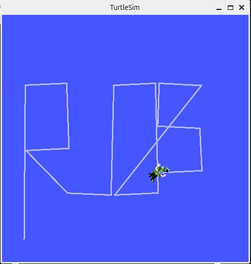

# LAYERED_EXERCISE


## HOW TO RUN THE CODE
This code was developed and tested using ROS2 jazzy on Ubuntu 24.04.01 system. Be sure to have the correct version running on your system.

1. Properly install this package in your ROS2 workspace within the path:
   ```
   nameROS2_ws/src/
   ```
2. In a terminal, build your ROS2 ws with the command:
   ```
   colcon build
   ```
3. Open a new terminal and source your workspace:
   ```
   source install/local_setup.bash
   ```
4. Now, in the same terminal where you sourced your workspace, navigate through the folders where the file turtle.launch.py is located
   ```
   nameROS2_ws/src/rosp_layered/launch
   ```
   and run it with the command:
   ```
   ros2 launch turtle.launch.py
   ```
## DESCRIPTION OF THE CONTENT

This package follows the standard ROS2 structure:

```bash
rosp_layered/
│── src/
│   ├── node.cpp  # Implementation of MotionControl class
│
│── include/rosp_layered/
│   ├── node.hpp  # Header file for MotionControl class
│
│── launch/turtle.launch.py # Launch file
│
│── CMakeLists.txt
│── package.xml

```
## GRAPH AND EXPECTED BEHAVIOUR





   
